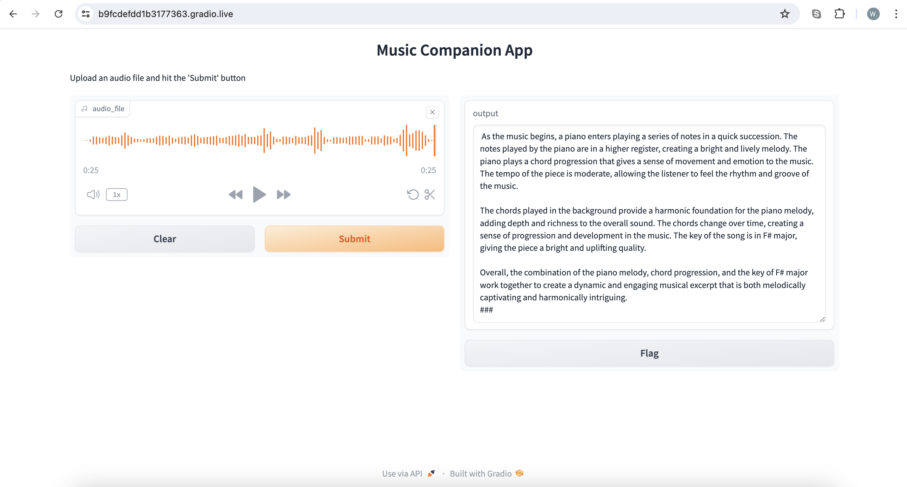

# musicft

* instruction fine tuned multi-modal model
* input: audio -> embedding, instruction-response from chatgpt based on midi files
* to train: python -m m2t.train
* to launch app: python -m app.padawanai_web

## demo

## ref
* https://arxiv.org/abs/2310.07160
* https://github.com/spotify-research/llark

